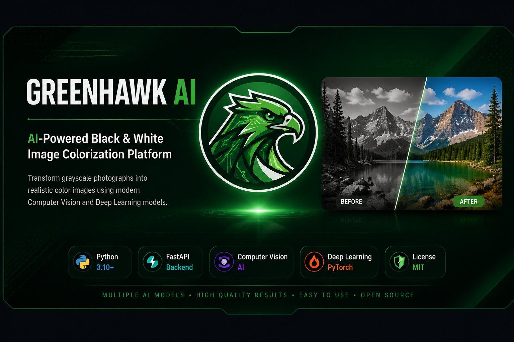
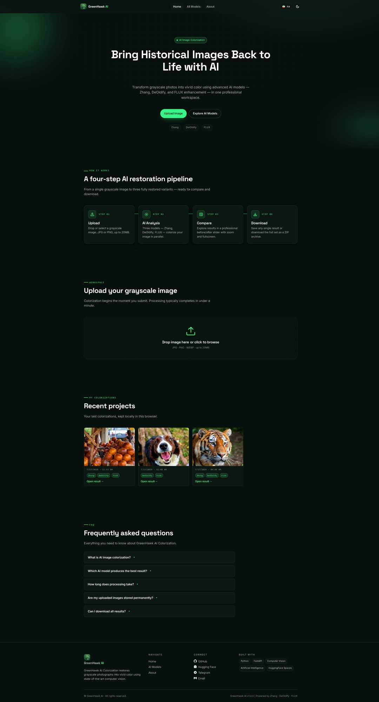
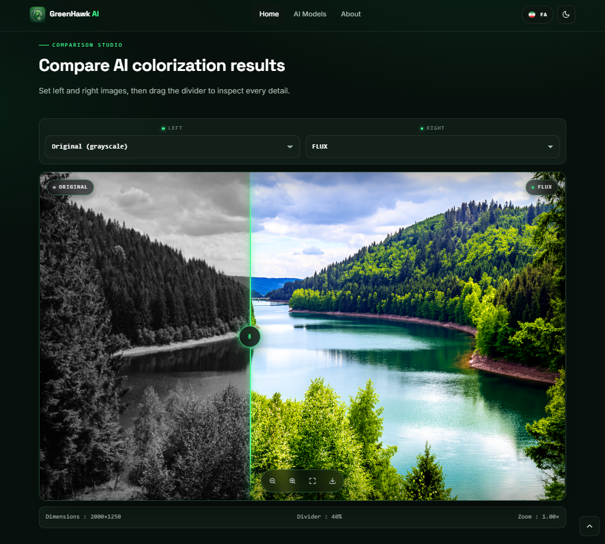
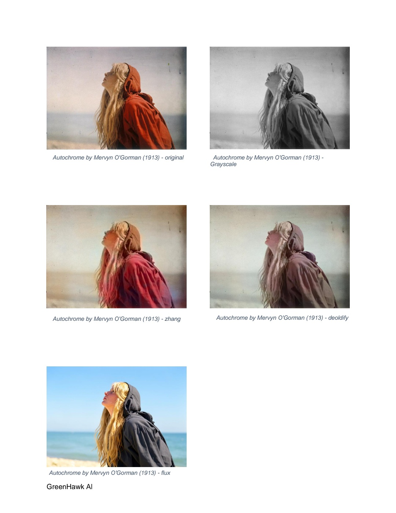
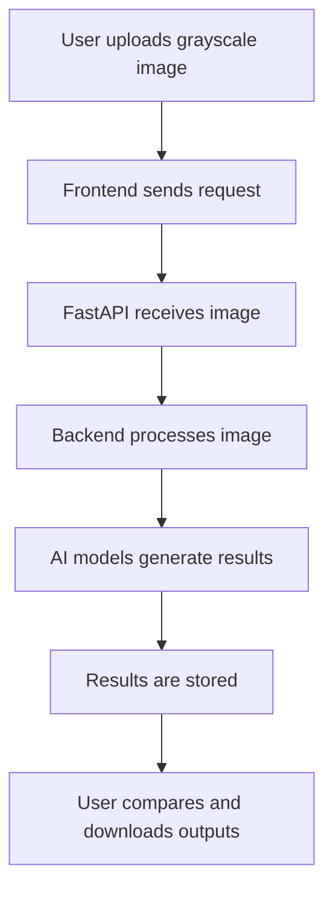

# GreenHawk AI

<p align="center">
  
</p>

<h1 align="center">GreenHawk AI</h1>

<p align="center">
  <b>AI-Powered Black & White Image Colorization Platform</b>
</p>

<p align="center">
  Transform grayscale photographs into realistic color images using modern Computer Vision and Deep Learning models.
</p>

<p align="center">
  
  
  
  
  
</p>

---

# Overview

**GreenHawk AI** is an AI-powered computer vision platform designed to restore and colorize black-and-white images using multiple deep learning approaches.

The system combines three different AI models with complementary capabilities:

- Classical CNN-based color prediction
- GAN-based historical photo restoration
- Diffusion-based generative enhancement

Instead of relying on a single model, GreenHawk AI provides a comparison environment where users can process one grayscale image through multiple AI pipelines and evaluate the results.

The goal of this project is to make advanced image restoration technologies accessible through a simple and user-friendly web application.

---

# Project Motivation

Historical photographs contain valuable memories and cultural information, but many of them exist only in grayscale formats.

Traditional image editing requires professional knowledge and manual effort.

GreenHawk AI aims to bridge this gap by providing:

- Automated AI-based color restoration
- Multiple model comparison
- Simple browser-based interaction
- Accessible computer vision technology

---

# Features

## AI Colorization Engine

Process grayscale images using multiple AI models:

| Model | Technology | Main Strength |
|-|-|-|
| Zhang Colorization | Deep CNN | Fast and balanced color prediction |
| DeOldify | GAN | Historical photo restoration |
| FLUX | Diffusion Model | Realistic detail enhancement |

---

## Comparison Studio

Users can:

- Upload a grayscale image
- Select AI models
- Generate multiple colorized versions
- Compare outputs side-by-side
- Download generated results

---

## Modern Web Interface

Features include:

- Responsive design
- Multi-language support
- Modern dashboard experience
- Before/after comparison workflow
- Image preview system

---

## Backend Processing Pipeline

The backend provides:

- REST API architecture
- AI service orchestration
- Image preprocessing
- Result management
- Storage handling
- Background job management

---

# Screenshots

## Home Interface



## AI Model Comparison



## Generated Results



> Screenshots will be updated with the final deployed version.

---

# System Architecture

```
                 User
                  |
                  |
            Front-end
                  |
                  |
             HTTP Request
                  |
                  |
            FastAPI Backend
                  |
        -----------------------
        |          |          |
        |          |          |
    Services    Jobs     Schemas
        |
        |
 Colorization Pipeline
        |
 -----------------------------
 |             |             |
Zhang       DeOldify       FLUX
CNN           GAN       Diffusion
 |
 |
Storage Manager
 |
 |
Output Files
 |
 |
Response to User

```

The system follows a modular architecture:

- Frontend handles user interaction
- FastAPI manages API communication
- Services coordinate AI processing
- AI models perform image restoration
- Storage layer manages generated files

---

# AI Models Used

## 1. Zhang Colorization

Technology:

- Deep Convolutional Neural Network
- Lab color space prediction

Role:

Provides fast and natural-looking colorization using learned color priors.

Advantages:

- Fast inference
- Stable output
- Suitable for general images

Limitations:

- Less detailed than modern generative models

---

## 2. DeOldify

Technology:

- Generative Adversarial Network (GAN)

Role:

Specialized in restoring historical photographs.

Advantages:

- Good results on old photographs
- Natural historical color style

Limitations:

- May produce conservative colors

---

## 3. FLUX

Technology:

- Diffusion-based generative enhancement

Role:

Produces highly detailed and visually rich results.

Advantages:

- Strong realism
- Better texture generation
- High-quality enhancement

Limitations:

- Higher computational requirements

---

# Technology Stack

## Frontend

| Technology | Purpose |
|-|-|
| HTML/CSS/JavaScript | User Interface |
| Modern Web Components | UI Interaction |
| Responsive Design | Multi-device Support |

---

## Backend

| Technology | Purpose |
|-|-|
| Python | Main Language |
| FastAPI | REST API Framework |
| Uvicorn | ASGI Server |
| OpenCV | Image Processing |
| Pillow | Image Handling |

---

## Artificial Intelligence

| Technology | Purpose |
|-|-|
| PyTorch | Deep Learning Framework |
| CNN Models | Image Color Prediction |
| GAN Models | Restoration |
| Diffusion Models | Enhancement |

---

## Deployment

| Technology | Purpose |
|-|-|
| Linux VPS | Production Server |
| Nginx | Reverse Proxy |
| SSL | HTTPS Security |
| Systemd | Backend Service Management |

---

# Installation

## Requirements

Before installation make sure you have:

- Python 3.10+
- Node.js 18+
- Git

---

# Clone Repository

```bash
git clone https://github.com/Greenhawk5/GreenHawk-AI.git

cd GreenHawk-AI
```

---

# Backend Setup

Navigate to backend:

```bash
cd backend
```

Create virtual environment:

```bash
python -m venv .venv
```

Activate environment:

Windows:

```bash
.venv\Scripts\activate
```

Linux/macOS:

```bash
source .venv/bin/activate
```

Install dependencies:

```bash
pip install -r requirements.txt
```

---

# Running Backend

Start FastAPI server:

```bash
uvicorn main:app --reload
```

Backend will run on:

```
http://127.0.0.1:8000
```

API documentation:

```
http://127.0.0.1:8000/docs
```

---

# Frontend Setup

Navigate to frontend:

```bash
cd frontend
```

Install dependencies:

```bash
npm install
```

Run development server:

```bash
npm run dev
```

---

# Configuration

Environment variables should be configured using:

```
.env
```

Example:

```env
API_URL=http://localhost:8000

MAX_IMAGE_SIZE=10MB

STORAGE_PATH=storage/
```

---

## API Overview

### Colorization Endpoint

POST /colorize

**Input:**

- Image file
- Selected model

**Supported models:**

- Zhang
- DeOldify
- FLUX

**Response:**

```json
{
  "status": "success",
  "results": {
    "zhang": "...",
    "deoldify": "...",
    "flux": "..."
  }
}
```

---

# Folder Structure

```text
GreenHawk-AI/

├── frontend/
│   ├── assets/
│   ├── css/
│   ├── js/
│   └── index.html
│
├── backend/
│   ├── main.py
│   ├── config.py
│   ├── models/
│   │   ├── zhang.py
│   │   ├── deoldify.py
│   │   └── flux.py
│   ├── services/
│   │   ├── colorization_service.py
│   │   ├── storage_manager.py
│   │   ├── quota_manager.py
│   │   └── url_service.py
│   ├── jobs/
│   │   └── job_manager.py
│   ├── data/
│   └── storage/
│       ├── outputs/
│       └── uploads/
│
├── docs/
├── LICENSE
├── README.md
├── CITATION.cff
├── CODE_OF_CONDUCT.md
├── CONTRIBUTING.md
└── SECURITY.md
```

---

# Example Workflow



---

# Future Improvements

Planned improvements:

- User authentication system
- Cloud storage integration
- Advanced model benchmarking
- GPU inference optimization
- More AI restoration models
- Automatic image quality enhancement
- Video colorization support

---

# Known Limitations

- AI-generated colors may not always represent original historical colors.
- Large images require more processing time.
- Generative models require higher computational resources.
- Output quality depends on input image quality.

---

# Academic Contribution

GreenHawk AI was developed as a Bachelor-level Computer Science project focusing on:

- Computer Vision
- Deep Learning
- AI Model Integration
- Web Application Development

The project demonstrates how multiple AI approaches can be integrated into a practical software system.

---

# Acknowledgments

Special thanks to the researchers and developers behind:

- Zhang et al. Colorization Model
- DeOldify Project
- FLUX Generative Models
- FastAPI Community
- Open Source AI Community

---

# Citation

If you use this project in academic work, please cite:

```bibtex
@software{greenhawk_ai,
  author = {GreenHawk},
  title = {GreenHawk AI: AI Powered Black and White Image Colorization Platform},
  year = {2026},
  url = {https://github.com/Greenhawk5/GreenHawk-AI}
}
```

---

# License

This project is released under the MIT License.

See:

```
LICENSE
```

for more information.

---

# Contact

Developer:

**GreenHawk**

GitHub:

https://github.com/Greenhawk5

Project Repository:

https://github.com/Greenhawk5/GreenHawk-AI

---

<p align="center">

Built with ❤️ using Artificial Intelligence and Computer Vision

</p>